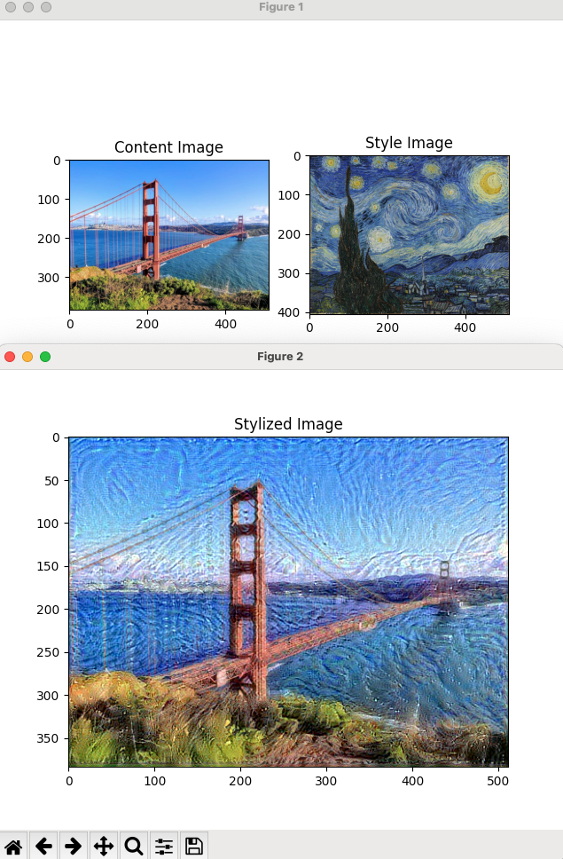

# Image Styler

```bash
virtualenv env
source env/bin/activate # macOS
deactivate
```

```bash
pip install -r requirements.txt # install dependencies from requirements.txt
pip freeze > requirements.txt
```

